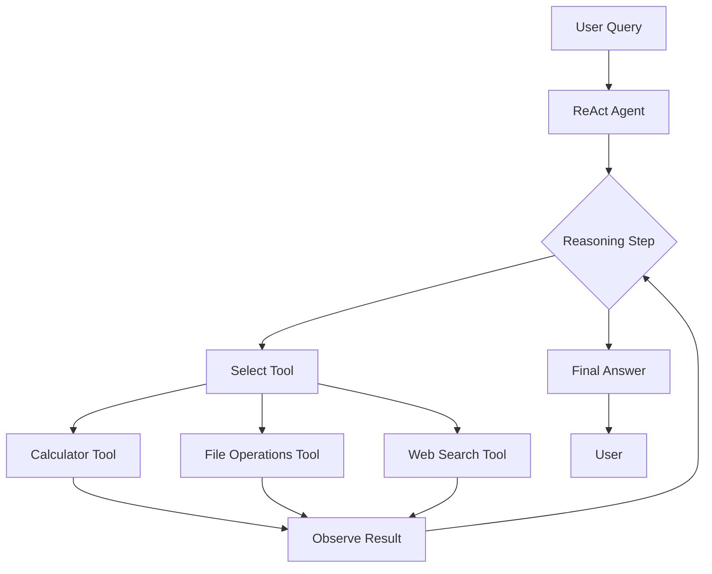

# LangChain ReAct Agent with Granite 4 Micro - Implementation Plan

## Project Overview

Create a comprehensive LangChain-based ReAct (Reasoning and Acting) agent using IBM's Granite 4 micro model via Ollama. The agent will demonstrate the ReAct pattern where the LLM reasons about what to do, takes actions using tools, observes results, and continues until the task is complete.

## Architecture



## Project Structure

```
langchain_granite_agent/
├── README.md                    # Comprehensive documentation
├── requirements.txt             # Python dependencies
├── run_agent.sh                # Shell script to run the agent
├── agent_config.py             # Configuration settings
├── tools/
│   ├── __init__.py
│   ├── calculator.py           # Mathematical operations tool
│   ├── file_operations.py      # File read/write/list tool
│   └── web_search.py           # DuckDuckGo search tool
├── langchain_react_agent.py    # Main ReAct agent implementation
├── examples.py                 # Example usage and demos
└── workspace/                  # Directory for file operations
```

## Key Components

### 1. LangChain Integration with Ollama

- Use `langchain-ollama` package for Granite 4 micro integration
- Configure ChatOllama with model: `granite4-micro`
- Set appropriate temperature and parameters for reasoning

### 2. Custom Tools

#### Calculator Tool
- Basic arithmetic operations (+, -, *, /)
- Advanced operations (power, sqrt, trigonometry)
- Expression evaluation using safe eval
- Error handling for invalid expressions

#### File Operations Tool
- Read file contents
- Write content to files
- List files in directory
- Create/delete files
- All operations scoped to workspace directory for safety

#### Web Search Tool
- Integration with DuckDuckGo search API
- Return top N results with snippets
- No API key required
- Rate limiting and error handling

### 3. ReAct Agent Implementation

**ReAct Pattern Flow:**
1. **Thought**: Agent reasons about the task
2. **Action**: Agent selects and uses a tool
3. **Observation**: Agent observes the tool's output
4. **Repeat**: Continue until task is complete
5. **Final Answer**: Provide result to user

**Key Features:**
- Automatic tool selection based on query
- Multi-step reasoning chains
- Error recovery and retry logic
- Conversation history tracking
- Streaming responses for real-time feedback

### 4. Example Workflows

**Example 1: Mathematical Reasoning**
```
Query: "What is 15% of 240, and then multiply that by 3?"
- Thought: Need to calculate 15% of 240 first
- Action: Use calculator(0.15 * 240)
- Observation: Result is 36
- Thought: Now multiply by 3
- Action: Use calculator(36 * 3)
- Observation: Result is 108
- Final Answer: 108
```

**Example 2: File Operations**
```
Query: "Create a file called notes.txt with a list of 5 programming languages"
- Thought: Need to create content and write to file
- Action: Use file_write("notes.txt", "1. Python\n2. JavaScript...")
- Observation: File created successfully
- Final Answer: Created notes.txt with 5 programming languages
```

**Example 3: Research Task**
```
Query: "Search for information about LangChain and summarize the top result"
- Thought: Need to search for LangChain information
- Action: Use web_search("LangChain framework")
- Observation: Found results about LangChain
- Thought: Summarize the top result
- Final Answer: [Summary of search result]
```

**Example 4: Multi-Tool Workflow**
```
Query: "Search for the current Python version, then create a file documenting it"
- Thought: First search for Python version info
- Action: Use web_search("latest Python version 2026")
- Observation: Python 3.13 is current
- Thought: Now create documentation file
- Action: Use file_write("python_version.txt", "Current Python version: 3.13...")
- Observation: File created
- Final Answer: Created python_version.txt with current Python information
```

## Technical Implementation Details

### LangChain Components Used

1. **ChatOllama**: LLM interface for Granite 4 micro
2. **Tool**: Base class for custom tools
3. **AgentExecutor**: Manages agent execution loop
4. **create_react_agent**: Factory function for ReAct agents
5. **PromptTemplate**: Custom prompts for agent behavior

### ReAct Prompt Template

```
Answer the following questions as best you can. You have access to the following tools:

{tools}

Use the following format:

Question: the input question you must answer
Thought: you should always think about what to do
Action: the action to take, should be one of [{tool_names}]
Action Input: the input to the action
Observation: the result of the action
... (this Thought/Action/Action Input/Observation can repeat N times)
Thought: I now know the final answer
Final Answer: the final answer to the original input question

Begin!

Question: {input}
Thought: {agent_scratchpad}
```

### Error Handling Strategy

1. **Tool Errors**: Catch and return error messages to agent
2. **Invalid Actions**: Provide feedback and retry
3. **Max Iterations**: Limit to prevent infinite loops
4. **Timeout**: Set reasonable timeout for long operations
5. **Graceful Degradation**: Provide partial results if possible

## Configuration Options

```python
AGENT_CONFIG = {
    "model": "granite4-micro",
    "temperature": 0.1,  # Low for consistent reasoning
    "max_iterations": 10,
    "max_execution_time": 60,
    "verbose": True,
    "return_intermediate_steps": True,
    "handle_parsing_errors": True,
}
```

## Dependencies

- **langchain**: Core LangChain framework
- **langchain-ollama**: Ollama integration
- **duckduckgo-search**: Web search capability
- **requests**: HTTP requests for Ollama API
- **python-dotenv**: Environment configuration (optional)

## Testing Strategy

1. **Unit Tests**: Test each tool independently
2. **Integration Tests**: Test agent with various queries
3. **Edge Cases**: Test error handling and edge cases
4. **Performance**: Measure response times and token usage

## Future Enhancements

1. **Memory**: Add conversation memory for context
2. **More Tools**: Add database, API, code execution tools
3. **Multi-Agent**: Coordinate multiple specialized agents
4. **Streaming**: Real-time streaming of thoughts and actions
5. **UI**: Web interface for easier interaction
6. **Logging**: Comprehensive logging and debugging

## Success Criteria

- ✅ Agent successfully uses all three tools
- ✅ Multi-step reasoning works correctly
- ✅ Error handling prevents crashes
- ✅ Clear documentation and examples
- ✅ Easy setup and execution
- ✅ Demonstrates ReAct pattern effectively

## Timeline

1. **Setup & Tools** (Tasks 1-5): Core infrastructure
2. **Agent Implementation** (Task 6): Main ReAct logic
3. **Examples & Documentation** (Tasks 7-8): User-facing materials
4. **Testing & Polish** (Tasks 9-10): Quality assurance

## Notes

- Granite 4 micro is optimized for efficiency and speed
- ReAct pattern is ideal for demonstrating agent reasoning
- Tools are designed to be safe and sandboxed
- Examples progress from simple to complex workflows
- Code follows best practices and is well-documented